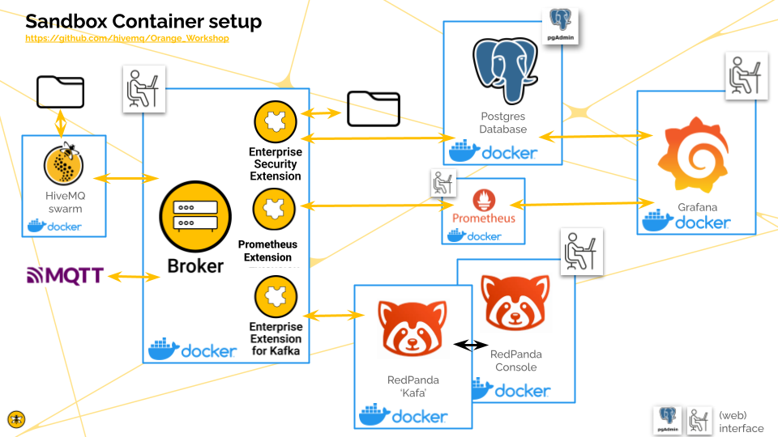

# Orange Workshop

Welcome. ....


## Who this workshop is for ?

This session is aimed at our partners' technical teams. We take a closer look at the platform, its different bricks and how they work.

We will cover topic like enterprise broker deployment and security, extension configuration, DataHub policies and transformations, HiveMQ Edge and it’s protocol adapters.

Prerequisite :

* Have a good understanding of HiveMQ Platform.
* Have basic knowledge Docker and linux.

## What is the goal of the training ?

The aim of this workshop is to train our partners' teams in the installation and advanced configuration of the HiveMQ platform.
After attending to the workshop, you will be able to implement a production site with best practices on security and enterprise extensions configured.

For a more detailed view click [here](https://github.com/hivemq/Orange_Workshop/blob/main/Overview.pdf)

## Preparations :

Have Docker, Docker Compose, Git, PgAdmin (optional) and the HiveMQ CLI installed:

[https://docs.docker.com/engine/install/](https://https://docs.docker.com/engine/install/)

[https://docs.docker.com/compose/install/](https://https://docs.docker.com/compose/install/)

[HiveMQ CLI](https://https://www.hivemq.com/blog/mqtt-cli/)

### Usefull additional software :

[PgAdmin](https://https://www.pgadmin.org/download/)

[Git CLI](https://https://git-scm.com/book/en/v2/Getting-Started-Installing-Git) or [GitDesktop](https://https://desktop.github.com/download/)

[MQTT explorer](https://mqtt-explorer.com/)

## Get it / Clone :

To get the resources please run the following command in your terminal:

```
git clone https://github.com/hivemq/Orange_Workshop.git
```

## What do you get ?

ds





## Use it / Start :

to start please `cd` into the `Orange_Workshop` directory and run the following commands:

```
export HIVEMQ_VERSION=4.38.0
export REDPANDA_VERSION=24.2.7
export REDPANDA_CONSOLE_VERSION=2.7.2
export PROM_VERSION=4.0.12
./build.sh
docker-compose up -d  --build --force-recreate
sleep 15
curl  -X POST localhost:8888/api/v1/data-hub/management/start-trial
mqtt hivemq schema create --id=mytemp-in-schema   --file=./resources-datahub/mytemp-in-schema.json   --type=json
mqtt hivemq schema create --id=mytemp-out-schema   --file=./resources-datahub/mytemp-out-schema.json   --type=json
mqtt hivemq script create --id=add_timestamp --file=./resources-datahub/add_timestamp.js --type=transformation
mqtt hivemq data-policy create --file=./resources-datahub/add_ts_policy.json
mqtt pub -t temp/test --message-file=./resources-datahub/mytemp.json
```

## and test it :

Send some MQTT data towards the Kafka propagation topic

```
mqtt pub -u superuser -pw supersecurepassword -t to-kafka/test -m kamiel
```

See in Redpanda console the MQTT sent message apear in the correct `kafka-topic` topic:

[http://localhost:8090/topics/](http://localhost:8090/topics/)
